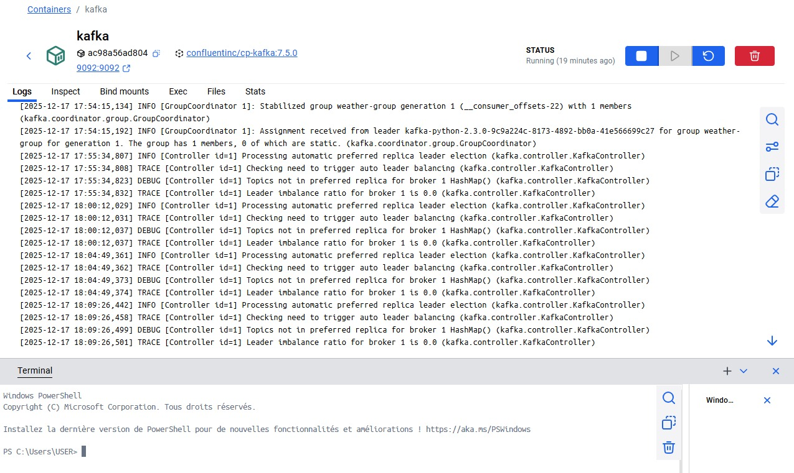
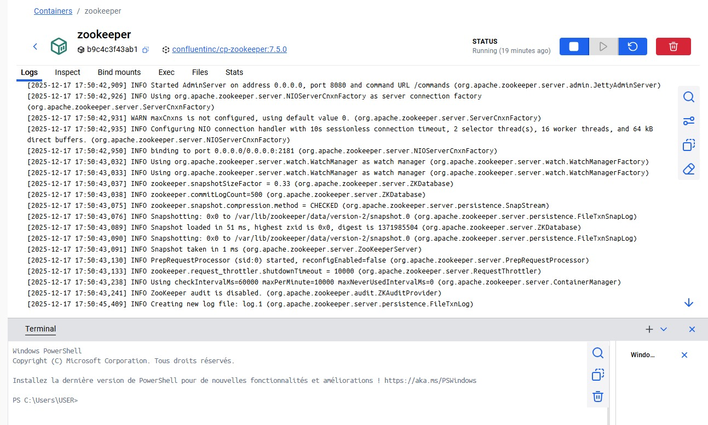
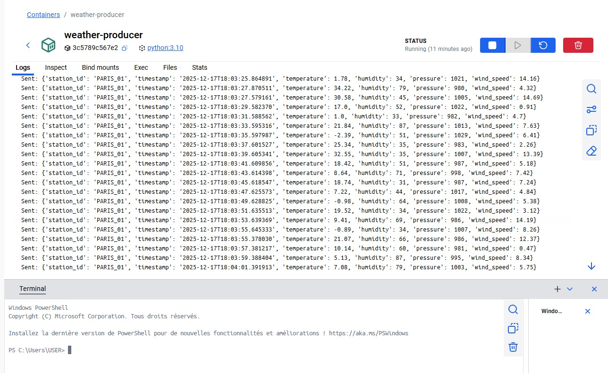
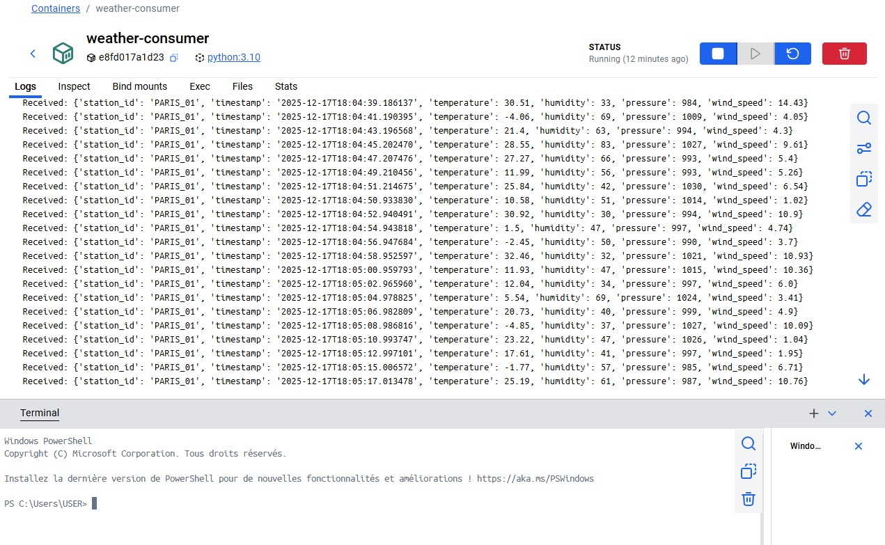

# Real-Time Weather Monitoring System using Apache Kafka

## 1. Project Description

This project demonstrates a real-time data streaming pipeline using **Apache Kafka**.  
The objective is to simulate meteorological sensors that continuously generate weather data and stream this data in real time.

The application is fully containerized using **Docker**, which makes the setup simple and reproducible.

---

## 2. Chosen Tool

### Apache Kafka

Apache Kafka was chosen because it is a distributed streaming platform designed for handling real-time data.  
It is widely used in Big Data architectures to ingest, buffer, and distribute large volumes of data with low latency.

Kafka is well suited for this use case because weather data is:
- continuous  
- produced in real time  
- potentially generated by many sensors  

---

## 3. Architecture Overview

The system is composed of **four Docker containers**:

- **Zookeeper**: manages Kafka coordination  
- **Kafka Broker**: handles message storage and streaming  
- **Weather Producer (Python)**: simulates weather sensors and sends data to Kafka  
- **Weather Consumer (Python)**: consumes and displays weather data in real time  


---
## 4. Data Format

Each message sent to Kafka is a JSON object containing weather measurements:

```json
{
  "station_id": "PARIS_01",
  "timestamp": "2025-12-17T18:05:00",
  "temperature": 21.4,
  "humidity": 63,
  "pressure": 1012,
  "wind_speed": 5.3
}
``` 

## 5. Installation and Execution of the Project

The project is executed using Docker Compose.

### Execution Steps
1. The project is launched from a terminal using the following command:
```bash
docker-compose up
```
Docker Desktop automatically starts all containers defined in the `docker-compose.yml` file.

Once the execution is launched, the following four containers are visible in the Docker Desktop interface:

- **Zookeeper**: Kafka cluster coordination service  
- **Kafka**: broker responsible for message storage and message streaming  
- **Weather Producer**: generation and transmission of weather data  
- **Weather Consumer**: real-time consumption and display of weather data  

The containers can be started, stopped, or restarted directly from Docker Desktop using the **Play** and **Pause** buttons.

The logs of each container are accessible from Docker Desktop and allow verification of:
- data being sent by the producer,
- data being received by the consumer,
- correct operation of Kafka and Zookeeper.


## 6. Execution Proof and Screenshots

This section presents screenshots taken from **Docker Desktop** to demonstrate the correct execution of the project and the interaction between all components of the Kafka pipeline.

---

### Kafka Broker



This screenshot shows the **Kafka broker container** running successfully.  
The logs indicate that Kafka is correctly started, that the consumer group is registered, and that the broker is handling message coordination and leader elections properly.  
This confirms that Kafka is operational and ready to stream data.

---

### Zookeeper



This screenshot shows the **Zookeeper container** running without errors.  
Zookeeper is responsible for coordinating the Kafka cluster.  
The logs confirm that Zookeeper started successfully, initialized its data directories, and is listening for Kafka connections.

---

### Weather Producer



This screenshot shows the **Weather Producer container**.  
The logs display multiple messages being sent to Kafka, each containing simulated weather data (station ID, timestamp, temperature, humidity, pressure, and wind speed).  
This confirms that the producer is correctly generating and publishing data to the Kafka topic in real time.

---

### Weather Consumer



This screenshot shows the **Weather Consumer container**.  
The logs display weather messages received from Kafka, corresponding to the data sent by the producer.  
This confirms that the consumer is successfully subscribing to the Kafka topic and consuming messages in real time.

---

## 7. Role of Kafka in a Big Data Ecosystem

Apache Kafka is a widely used tool in Big Data projects to manage real-time data streams.

In a Big Data ecosystem, Kafka is mainly used to collect data coming from different sources such as sensors, applications, or IoT devices, and to send this data to other systems. Kafka allows producers and consumers to be independent from each other, which makes the system more flexible and scalable.

In this project, Kafka is used as an intermediary between the producer and the consumer. The weather data generated by the producer is sent to Kafka and then read by the consumer.

---

## 8. Challenges Encountered and Solutions

During the development of this project, several challenges were encountered.

The main difficulty was related to the startup of Kafka, Zookeeper, the producer, and the consumer at the same time. In some cases, the producer and consumer tried to connect to Kafka before it was fully ready, which caused connection issues.

This problem was solved by checking the logs in Docker Desktop and restarting the services once Kafka was properly running.

Another challenge was verifying that the data was correctly transmitted. This was done by analyzing the producer and consumer logs to make sure that messages were successfully sent and received.

---

## 9. My Setup Notes

This project helped us better understand how Big Data tools work together in a containerized environment.

One of the most important things we learned is that Kafka does not run directly inside the code editor, but inside Docker containers. VS Code is mainly used to write code and run commands, while Docker Desktop is used to monitor containers and view logs.

We also learned how useful logs are when debugging issues in distributed systems. By reading the Kafka, producer, and consumer logs, we were able to understand where problems came from and how to fix them.

Overall, this project improved our understanding of Docker Compose, Kafka, and real-time data streaming in a Big Data context.


